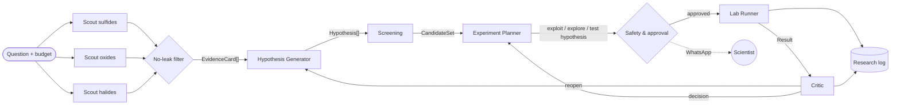

# IonForge

**An agentic lab on Omnigent that searches for lithium superionic solid electrolytes using far fewer lab measurements.**

Hack-Nation · Challenge 03 · Databricks Agentic Scientific Discovery

> AI-generated hypotheses produced by IonForge are not lab-validated.

## The problem
Solid electrolytes would make lithium batteries non-flammable, but they need σ ≥ 10⁻³ S/cm at room temperature. Each real measurement (synthesis + impedance spectroscopy) takes days, so the bottleneck is **choosing which experiment to run next**.

**Question.** Can a lab of agents, guided by literature and an uncertainty-aware surrogate, find superionic conductors with fewer measurements than random search and than Bayesian optimization without agents, including a BO that also starts with prior knowledge?

## Experimental design
- **Data:** [OBELiX](https://github.com/NRC-Mila/OBELiX), 599 solid electrolytes with experimentally measured room-temperature ionic conductivity. See [docs/EDA.md](docs/EDA.md).
- **Oracle:** conductivity stays hidden in `oracle.measure()`; each call spends one unit of a **50-measurement budget** (10 rounds × 5).
- **Target:** top 5% of log σ (log σ ≥ −2.316, 30 materials), because 16.7% of the pool clears 10⁻³ S/cm and random search would find those too quickly.
- **Metrics:** measurements to find the first k = 3 targets (median + IQR over seeds), speed-up versus each baseline, and **distinct structural families found**.
- **No-leak rule:** no evidence card may carry a conductivity value for a pool material or a doped variant of one. Blocked cards are counted and reported. See `literature/leak_filter.py`.

| Strategy | Seeds | LLM |
|---|---|---|
| Random | 50 | No |
| Expert heuristic | 50 | No |
| BO (RF + UCB), cold start | 50 | No |
| **BO + prior knowledge** (the fair comparison) | 50 | No |
| **IonForge** | 5 | Yes |
| Ablation 1: no literature | 3 | Yes |
| Ablation 2: anonymized formulas | 3 | Yes |

## Architecture


| Agent | Decision it owns | Model |
|---|---|---|
| Literature Scout ×3 | What evidence exists for its family | Mistral + Claude Haiku |
| Hypothesis Generator | Which hypotheses are worth testing | Claude Sonnet |
| Screening | Which candidates satisfy each hypothesis | Claude Haiku + Python |
| Experiment Planner | Which batch to measure (scores 3 designs per round) | Claude Sonnet |
| Safety & approval | Whether spending is allowed | Omnigent policies + WhatsApp (Zavu) |
| Lab Runner | Runs the measurement | Code only |
| Critic | Whether the conclusion holds | Non-Anthropic model via OpenRouter |

## Repository
```
agents/        Omnigent agent specs (YAML)
policies/      spend cap, mandatory approval for measure(), loop detection
lab/           oracle, features, surrogate, baselines, metrics
literature/    openalex/arXiv, BrightData SERP, Mistral OCR, card extraction, citation check, no-leak filter
integrations/  critic (OpenRouter), zavu (WhatsApp approvals), elevenlabs (voice), supabase_sync
supabase/      schema.sql + zavu-webhook edge function
scripts/       EDA, demo data seed/clear
docs/          EDA notes, Lovable prompt
results/       JSON results and figures
```

## Reproduce
```bash
python3 -m venv .venv && source .venv/bin/activate
pip install -r requirements.txt
cp .env.example .env            # fill in keys
git clone https://github.com/NRC-Mila/OBELiX data/raw/obelix
python scripts/eda_obelix.py    # builds data/pool.csv
python -m literature.run_scouts # evidence cards + no-leak report
# lab campaigns: see lab/ (TODO)
```

## Results
_TODO: discovery curves, measured speed-up vs BO + prior knowledge, ablations, blocked-card count._

## Next experiment
_TODO: top out-of-dataset candidates from Materials Project with uncertainty and applicability-domain check._

## Limitations
_TODO_

## Team
_TODO_
