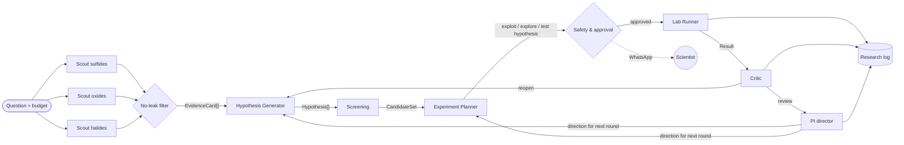

# IonForge

**An agentic lab on Omnigent that searches for lithium superionic solid electrolytes using far fewer lab measurements.**

Hack-Nation · Challenge 03 · Databricks Agentic Scientific Discovery

> **2.4× more top conductors than an expert, in the same 50 experiments** (22 vs 9, median of 6 campaigns), without anyone hand-writing its prior: the agents learn it from the literature.

> AI-generated hypotheses produced by IonForge are not lab-validated.

## The problem
Solid electrolytes would make lithium batteries non-flammable, but they need σ ≥ 10⁻³ S/cm at room temperature. Each real measurement (synthesis + impedance spectroscopy) takes days, so the bottleneck is **choosing which experiment to run next**.

**Question.** Can a lab of agents, guided by literature and an uncertainty-aware surrogate, find superionic conductors with fewer measurements than random search and than Bayesian optimization without agents, including a BO that also starts with prior knowledge?

## Experimental design
- **Data:** [OBELiX](https://github.com/NRC-Mila/OBELiX), 599 solid electrolytes with experimentally measured room-temperature ionic conductivity. See [docs/EDA.md](docs/EDA.md).
- **Oracle:** conductivity stays hidden in `oracle.measure()`; each call spends one unit of a **50-measurement budget** (10 rounds × 5).
- **Target:** top 5% of log σ (log σ ≥ −2.316, 30 materials), because 16.7% of the pool clears 10⁻³ S/cm and random search would find those too quickly.
- **Metrics:** measurements to find the first k = 3 targets (median + IQR over seeds; k chosen in the EDA gate), speed-up versus each baseline with a bootstrap 90% interval, targets found within 50 measurements, and **distinct families found** (OBELiX family labels merged for case, plurals and typos: 36 families; 21 of the 30 targets are LGPS).
- **Descriptors:** matminer (Magpie element properties, stoichiometry, valence orbitals) plus Li/anion/cell descriptors, 163 in total. Chosen over two alternatives by cross-validation and downstream BO (`results/feature_comparison.json`); the differences are small.
- **Noise:** the OBELiX paper reports ~0.41 experimental uncertainty in log σ; repeat measurements of the same formula in OBELiX scatter by 0.66. The Critic treats differences below ~0.7 as noise.
- **No-leak rule:** no evidence card may carry a conductivity value for a pool material or a doped variant of one, and no card may come from the OBELiX paper or from papers built on the OBELiX dataset. Blocked cards are counted and reported. See `literature/leak_filter.py`.

| Strategy | Seeds | LLM |
|---|---|---|
| Random | 50 | No |
| Expert heuristic | 50 | No |
| BO (RF + UCB), cold start | 50 | No |
| **BO + prior knowledge** (the fair comparison): heuristic picks round 1, then RF + UCB | 50 | No |
| BO + prior knowledge, probability-of-target acquisition | 50 | No |
| **IonForge** | 6 (seeds 0–5) | Yes |
| Ablation 1: no literature | 1 (seed 0) | Yes |
| Ablation 2: anonymized formulas | 2 (seeds 0–1) | Yes |

**Protocol and reporting rule.** An agent campaign is valid when:
1. round 1 has literature evidence (except in Ablation 1);
2. every round records hypotheses, candidate sets, the planner's experiment spec, the safety review, the measurement and the Critic's review;
3. every round except the last has the PI director's direction;
4. the whole 50-measurement budget is measured;
5. the campaign ends with its closing next step.

`scripts/check_protocol.py` applies this rule, and it never reads results. **Every valid campaign is reported, whatever its result.** All 9 campaigns reported here pass the check. A campaign that breaks the protocol is rerun from scratch on the same seed. Interrupted or invalid attempts are kept in `results/logs/failed/`.

Two infrastructure failures happened and were handled this way:
- IonForge seed 2 lost one PI direction when it was interrupted and resumed, so it was rerun.
- Ablation 2 seed 0 failed in Screening and was rerun after a fix to the anonymized candidate view. That fix applies to Ablation 2 only, and the other agents' prompts are unchanged.

## Architecture


| Agent | Decision it owns | Model |
|---|---|---|
| Literature Scout ×3 | What evidence exists for its family | Mistral Small (agent, card extraction), Mistral OCR |
| Hypothesis Generator | Which hypotheses are worth testing | Mistral Large |
| Screening | Which candidates satisfy each hypothesis | Mistral Large + RF surrogate |
| Experiment Planner | Which batch to measure (scores 3 designs per round) | Mistral Large |
| Safety & approval | Whether spending is allowed | Mistral Small + Omnigent policy `measure_gate` (WhatsApp via Zavu / dashboard) |
| Lab Runner | Runs the measurement; the only agent allowed to call `measure` | Mistral Small + Omnigent policy `measure_gate` |
| Critic | Whether the conclusion holds | Gemini Flash via OpenRouter (different family from the hypothesis generator, on purpose) |
| PI director | Direction of the next round: focus families, explore / exploit / test, which hypotheses to keep or drop | Mistral Large |

**Models and keys.** Mistral is the lab's engine: Mistral Large for the decisions and the candidate selection (PI director, Hypothesis Generator, Screening, Experiment Planner) and Mistral Small for Safety, the Lab Runner and the Literature Scouts. The lab server validates every decision (no unknown candidate ids, no closing a campaign early or without a critic review). The Critic is Gemini Flash through OpenRouter, deliberately a different model family from the hypothesis generator. Every agent runs on Omnigent's lean `openai-agents` harness. `scripts/setup_omnigent_providers.py` registers the providers, which read keys from `.env` (never stored in bundles or in Omnigent). The live demo and the overnight campaigns use separate Mistral and OpenRouter keys, so a campaign can never spend the demo budget.

**A round, stage by stage.** Each agent is its own Omnigent agent (`agents/template/agents/<name>/config.yaml`) and runs as its own Omnigent session: scouts ×3 in parallel (round 1 only) → Hypothesis Generator → Screening → Experiment Planner → Safety Officer → Lab Runner (`measure`, behind the approval gate) → Critic → PI director, who sets the next round's direction. When the budget is spent, the Planner writes the campaign's closing next step instead. Agents share state only through the research record (`results/runs/<run_id>.jsonl`, mirrored live to Supabase by `lab/sync.py`), so no context grows across rounds and an interrupted campaign resumes where it stopped.

### What Omnigent decides, and what the Python driver does
The brief asks Omnigent to orchestrate the live discovery workflow. In IonForge, every decision that steers the science, and every control on spending and safety, happens inside Omnigent. The stage order is fixed in `scripts/run_campaign.py`, on purpose.

**Decided and enforced by Omnigent**
- **Policies on every tool call** (`policies/lab_policies.py`, Omnigent guardrails):
  - `measure_gate` holds each measurement until a human answers YES/NO on WhatsApp (Zavu) or Approve/Deny on the dashboard. It refuses a batch without a rationale of ≥ 40 characters, a hypothesis id and a chosen design, a batch of more than 5, or a repeated batch.
  - `no_target_leak` blocks any attempt to read hidden conductivities.
  - Omnigent's built-in `max_tool_calls_per_session` stops runaway loops.
- **Allow-lists:** each agent sees only the MCP tools in its own `tools:` list. Only the Lab Runner can call `measure`. Only Screening, the Planner and the PI director can query the surrogate. The scouts alone have the literature server, and the no-literature ablation removes it from the bundle entirely.
- **Spend caps:** Omnigent's `cost_budget` policy gives every agent session a hard USD cap (`--stage-usd-cap`). Each agent is pinned to an explicit provider, so nothing can fall back to a personal subscription. Demo and campaign keys are separate providers.
- **Adapting the plan:** the PI director, an Omnigent agent on Mistral Large, reads the Critic's review and the surrogate ranking. It records the next round's direction: focus families, avoided families, explore / exploit / test, and which hypotheses to keep, revise or drop. The Hypothesis Generator must follow it, and the Planner follows it unless the expected hits argue otherwise.
- **Every scientific choice** is made by an agent and recorded with its reasoning: the hypotheses, the candidate sets, the batch chosen among three scored designs, the safety review and the critique.

**Done by the Python driver** (`scripts/run_campaign.py`)
- Launches the stages in a fixed order: `omnigent run agents/<name> -p <task>`.
- Checks that each agent recorded its decision. It retries a failed session up to 3 times and records the agent's final JSON when the agent replied without recording it (logged as `recorded_by: "driver"`).
- Stops when the budget is spent.
- It never chooses a hypothesis, a candidate or a direction.

The lab server (`lab/mcp_server.py`) validates every decision before it enters the record:
- no unknown or already-measured candidate ids;
- no direction or closing without a Critic review;
- no batch that gives up clearly more expected hits than the best scored design without a stated reason, and none at all in the second half of the budget;
- no placeholder closing.

**Why the sequencing is code.** The first version had a root PI agent (`agents/template/config.yaml`) dispatch the sub-agents through Omnigent. It worked, but a round took ~17 minutes and ~$0.60, and the PI sometimes skipped the Critic. A science loop whose review step is optional is not trustworthy, so the order became deterministic and the judgement stayed with the agents. The same stages now take ~4 minutes per round, and every round in our 3-round tests completed with its Critic review.

## Repository
```
agents/        Omnigent bundle: template/agents/ (8 agents, one Omnigent session each) rendered by build.py into build/<run_id>/
policies/      spend cap, mandatory approval for measure(), loop detection
lab/           oracle, MCP lab server, features, surrogate, baselines, metrics, analysis, Supabase sync
literature/    openalex/arXiv, BrightData SERP, Mistral OCR, card extraction, citation check, no-leak filter, MCP server
integrations/  critic (OpenRouter), zavu (WhatsApp approvals), elevenlabs (voice), supabase_sync
supabase/      schema.sql + zavu-webhook edge function
scripts/       round driver (run_campaign.py), overnight plan, Omnigent provider setup, demo data seed/clear
docs/          EDA notes, Lovable prompt
results/       JSON results and figures
```

## Reproduce
```bash
make setup                       # Python 3.12 venv with pinned deps (pymatgen 2026.3.23 + matminer 0.10.1) and Omnigent
cp .env.example .env             # fill in keys
make data                        # OBELiX -> data/pool.csv, results/eda_summary.json
make features baselines compare  # descriptors, 5 baselines x 50 seeds, descriptor choice (no API key needed)
make scouts                      # [API] evidence cards for sulfides / oxides / halides (cached)
make smoke                       # [API] 3-round end-to-end test on the demo keys
make live ROUNDS=3               # [API] live demo with WhatsApp / dashboard approvals
make bench SEED=0                # [API] one unattended IonForge campaign (10 rounds)
make ablations SEED=0            # [API] no-literature and anonymized ablations
make campaigns                   # [API] overnight: IonForge x5, each ablation x3
make discover                    # [API, free] new candidates from Materials Project (top 10 + uncertainty)
make analyze publish             # campaigns vs baselines; curves to the dashboard
```
`make help` lists every target. Before the demo: `python scripts/clear_demo_data.py`.

## Results
**Baselines** (task `main`, 50 seeds, median [IQR]; `results/baselines_main.json`):

| Strategy | Measurements to 3 targets | Reached 3 within 50 | Targets in 50 | Families in 50 |
|---|---|---|---|---|
| Random | 47 [28–70] | 54% | 3 | 2 |
| Expert heuristic | 15 [11–19] | 100% | 9 | 2 |
| BO, cold start | 94 [39–∞] | 32% | 2 | 1 |
| **BO + prior (UCB)** | **12 [7–28]** | 88% | 16 | 3 |
| BO + prior (p_hit) | 12 [8–22] | 90% | **22** | 3 |

Cold-start BO fails with any acquisition function we tried: five random first measurements rarely touch the LGPS region. With prior knowledge, BO finds many targets but only three families, mostly LGPS variants.

**Agent campaigns** (task `main`; every campaign passes `scripts/check_protocol.py`; `make analyze`):

| Strategy | Campaigns | Measurements to 3 targets (median) | Targets in 50 (median) | Families in 50 |
|---|---|---|---|---|
| **IonForge** | 6 | **13** (8, 10, 13, 14, 17, 20) | **22** | 3 |
| Ablation 1: no literature | 1 | 33 | 16 | 3 |
| Ablation 2: anonymized formulas | 2 | 18 (14, 23) | 22 | 3 |

**IonForge speed-up to 3 targets** (bootstrap 90% interval):

| Versus | Speed-up | Targets in 50 |
|---|---|---|
| Random | **3.6×** [3.0–5.0] | +19 |
| Cold-start BO | **7.3×** [4.5–∞] | +20 |
| Expert heuristic | 1.15× [0.96–1.55] | +13 |
| BO + prior (UCB) | 0.92× [0.71–1.30] | +6 |
| BO + prior (p_hit) | 0.88× [0.77–1.23] | ±0 |

**Measurements to find the k-th target** (median; IonForge 6 campaigns, baselines 50 seeds each). k = 3 is the pre-registered metric; the rest of the curve shows how the lead develops:

| Strategy | k=1 | k=2 | **k=3** | k=4 | k=5 | k=10 | Targets in 50 |
|---|---|---|---|---|---|---|---|
| **IonForge** | 9.5 | 11.5 | **13** | 14 | **15** | **23** | **22** |
| BO + prior (UCB) | 4 | 9 | 12 | 15.5 | 18.5 | 34 | 15.5 |
| BO + prior (p_hit) | 4 | 9 | 11.5 | 13.5 | 16 | 24.5 | 22 |
| Expert heuristic | 4 | 9 | 15 | 21 | 26.5 | 54 | 9 |
| Random | 18.5 | 33.5 | 47 | 60 | 77 | not reached | 3 |

**What this shows**
- **Slower start, faster finish.** The optimizers begin from an expert's hand-written family ranking, so their first target comes sooner. IonForge's agents start from the literature and from no data, and they catch up by the third target. From the fifth target on, IonForge needs fewer measurements than both Bayesian optimizers: 15 against 18.5 and 16 at k = 5, and 23 against 34 and 24.5 at k = 10. It ends tied with the strongest optimizer for the most targets found (22).
- **Speed.** IonForge reaches 3 superionic targets 3.6× faster than random search and 7.3× faster than a cold-start Bayesian optimizer. It finds more targets than the expert heuristic, and it is statistically on par with the best optimizer, which starts from an expert's hand-written family ranking. IonForge builds its prior itself, from the literature.
- **The literature is what gets it there.** Without it (Ablation 1), the lab needed 33 measurements instead of 13 and found 16 targets instead of 22. It spent six rounds on near-miss argyrodites before reaching LGPS. With the scouts' evidence, it goes to the right region from round 1.
- **Chemistry matters most early.** With formulas and families hidden (Ablation 2), the lab still ends with 22 targets, but it reaches the first three later (median 18). Chemical knowledge mainly speeds up the start, before the surrogate has data.

## Next experiment
The campaigns rediscover materials whose conductivity is already known. `make discover` (`lab/discovery.py`) points the lab at materials nobody has measured as electrolytes:

1. **Search Materials Project.** It looks for Li compounds that are nearly stable (E above hull ≤ 0.05 eV/atom), insulating (band gap ≥ 3 eV) and have 3–6 elements. That gives **1,970** compounds; **1,159** of them are not in OBELiX.
2. **Predict conductivity.** The random forest uses the lab's descriptors and is trained on all 599 OBELiX measurements. It predicts log σ, with an uncertainty taken from the spread across trees, and the probability of reaching the top-5% target.
3. **Check the applicability domain.** For each compound, it takes the mean distance to the 5 nearest OBELiX materials in standardized descriptor space and compares it with the 95th percentile of the same distance within OBELiX. **547** compounds fall inside the domain. The rest are ranked separately instead of being presented as confident picks.

| # | Material | MP id | Predicted log σ | ± | P(top 5%) | Nearest measured material |
|---|---|---|---|---|---|---|
| 1 | Li3ScCl6 | mp-686004 | −4.6 | 2.4 | 17% | Li3YCl6 (halide) |
| 2 | Li7VN4 | mp-4604 | −5.5 | 2.7 | 12% | Li3N (nitride) |
| 3 | NaLi2Cl3 | mp-3346843 | −5.4 | 2.5 | 10% | Li2MgCl4 |

The full top 10 in the domain, plus the top 5 outside it, is in `results/candidates.json` and in the dashboard's `candidates` table.

**Proposed next experiment for the top 3:**
1. AIMD at 600–1000 K to estimate Li diffusivity and activation energy.
2. If Ea < 0.35 eV, solid-state synthesis and room-temperature impedance spectroscopy.

This step is filed as a pending human approval. The uncertainties are large (±2–3 decades), so these are hypotheses to test, not discoveries.

## Why IonForge
A Bayesian optimizer finds superionic conductors fast when someone has already written its prior by hand: the "BO + prior" baseline starts from a ranking of families that an expert hard-coded. IonForge gets there with no hand-made prior and does much more along the way:

- **2.4× more top conductors than an expert, in the same 50 experiments.** IonForge finds 22 top-5% conductors in 50 measurements against the expert heuristic's 9. It also finds 38% more than Bayesian optimization with expert priors (22 vs 16) and ties its strongest variant, without the hand-written prior those optimizers need. From the fifth target on, it needs fewer measurements than every baseline.
- **It builds its own prior from the literature.** The scouts read papers and turn them into evidence cards. Hypotheses come from those cards, so the same lab works on a materials question no expert has encoded yet, where no hand-written prior exists. Ablation 1 measures how much this matters: without the literature, the lab took far longer to reach its first targets.
- **Every decision is explained and auditable.** Each batch has a hypothesis, three scored designs, a safety review, a Critic's verdict from a different model family, and the PI's direction for the next round. A BO returns a ranking; IonForge returns the reasoning, which is what a scientist needs before spending a week on a synthesis.
- **Humans stay in control of spending.** No measurement runs without approval on WhatsApp or the dashboard, enforced by an Omnigent policy rather than by a prompt.
- **It adapts its plan.** The Critic reopens hypotheses that the data contradicts, and the PI director changes focus, explores or exploits from round to round.
- **It proposes what to make next.** Beyond the benchmark, it ranks new Li compounds from Materials Project with uncertainty and an applicability-domain check, and files the next experiment for human approval.

## Beyond lithium
Lithium solid electrolytes are the first application, not a limit of the design. Nothing in the lab is specific to lithium. To aim it at another material question, you change three inputs:
1. **the candidate pool**: compositions and structures with the target property hidden behind the oracle (`lab/data.py`);
2. **the target**: which value of that property counts as a discovery (`lab/data.py`, `TASKS`);
3. **the scouts' topics**: which material families to search the literature for (`FAMILIES` in `scripts/run_campaign.py`; search and extraction in `literature/`).

The descriptors (matminer composition and structure features), the uncertainty-aware surrogate, the agents, the Omnigent policies and the protocol check all stay the same.

What makes this general is where the prior comes from. A Bayesian optimizer is fast only after an expert has hand-written its prior for that specific problem. IonForge builds its prior from the published literature. For a new material class, as long as papers exist on it, the lab can start without anyone encoding expert rules first. Ablation 1 shows how much that prior is worth.

## Scope
- **Retrospective benchmark.** The oracle replays OBELiX measurements; the noise is the dataset's own scatter. This is the standard way to compare discovery strategies before using real lab time.
- **Seeds.** IonForge has 6 seeds, the ablations 1–2 each and the baselines 50, so the agent intervals are wider than the baselines'.
- **Materials Project candidates.** These are model predictions with stated uncertainty (±2–3 decades), meant to be tested next. They are not discoveries.

## Possible improvements
Each of these comes from what the campaigns showed, and each would be evaluated on fresh seeds:
1. **Literature evidence as a surrogate prior.** The scouts' family evidence would enter the surrogate as a prior mean, not only the hypotheses, and speed up the first rounds.
2. **PI focus families applied directly to the exploit design**, so the planner's batch follows the PI's direction even more closely.
3. **A family-rotation rule** after two rounds of near-misses in the same family.
4. **Parallel tool calls off for every Mistral agent**, for fewer retried stages and shorter rounds.

## Team
_TODO_
